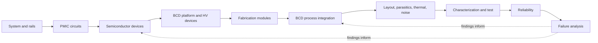

# PMICBook v1 architecture

**Status:** Drafted after the unmodified ProcessBook baseline audit, 2026-10-02
**Starting point:** `geniuskey/processbook` at `0bc4314d1e13c485a658e0cb1d4fd237b5fc8dff`, retained as `upstream-processbook-baseline`

## Product path

PMICBook teaches one connected engineering path: power-system needs shape circuit choices; circuits depend on device behavior; devices are enabled and constrained by BCD technology and process integration; layout and package parasitics affect thermal, noise, and efficiency; characterization, reliability, and failure analysis feed learning back into the design.

The user selected **bilingual English and Korean**. Each of the 25 subject chapters has paired English and Korean routes with the same learning objectives, a matching-chapter EN/KO switcher, localized navigation and knowledge checks, and equivalent interactive teaching. The Korean home and chapters live under `ko/`; they are language versions of the same book, not extra subjects. Translate/adapted upstream educational material must be identified as modified and attributed under CC BY 4.0. Localized metadata, `lang`, canonical, `hreflang`, and sitemap entries must describe the actual route language.

## Upstream site audit

### Site framework and navigation

- The site is static HTML/CSS/classic JavaScript with no package manifest, build step, server-side application, or test suite. Upstream documents `python3 -m http.server 8000` and CDN access for KaTeX, Three.js, and fonts.
- `index.html` is a hand-authored landing page; `js/common.js` owns the ordered `PB.CHAPTERS` registry and builds the drawer, active chapter state, progress bar, section TOC, previous/next pager, footer, quiz responses, and KaTeX auto-render hook.
- Chapter HTML uses `data-chapter` and `<!--head:start ...-->` metadata markers. `tools/head.py` regenerates chapter SEO/JSON-LD, the sitemap, and the home page `hasPart` list from `PB.CHAPTERS`.
- The chapters are self-contained documents. Internal chapter links and generated links follow the registry order; a PMICBook taxonomy change must update the registry, metadata generator outputs, sitemap, home cards, and glossary chapter index together.
- `css/style.css` defines color, typography, material, and layout tokens, plus light/dark themes through `data-theme` and responsive breakpoints. `js/common.js` persists the theme selection locally. Keep its menu and mobile drawer behavior.

### Shared learning/UI systems

- `PB` provides color/theme access, canvas/HiDPI resize handling, charts, ranges/segmented controls, stats, formatting, math helpers, seeded randomness, animation loops, and optional Three.js setup.
- Chapter patterns include SVG diagrams, equations, callouts, tables, interactive controls, summary sections, and `.quiz-q` knowledge checks.
- `js/optics.js` exports `OPT`, a one-dimensional partially coherent lithography model. It is useful only for the retained fabrication/patterning treatment; its leading-edge lithography detail should not drive the PMICBook chapter map.

### Process cross-section engine

- `js/xsec.js` exports `XS.Sim`, `XS.stepper`, and material/dopant helpers. `Sim` stores a two-dimensional periodic-x cell grid with material ID, implant/dopant concentration, and accumulation arrays; `XS.draw` renders the cross-section with optional doping/junction overlays.
- Existing operations include deposition (CVD/ALD/PVD/epi), etch, lithography, implant, anneal/diffusion, oxidation, CMP, strip, silicide, rectangle drawing, and custom functions. The stepper supports process-step descriptions, animation, playback, range selection, and cursor readout.
- This is an educational 2D process model. Its existing CMOS flow is not a validated BCD or foundry recipe, and it does not solve a three-dimensional electric-field/BV problem. Keep those limits visible. BCD examples can use annotated geometry and illustrative well/drift dopant profiles without claiming manufacturing accuracy.
- Existing materials include silicon, oxide, nitride, polysilicon, tungsten, copper, aluminum, TiN, high-k dielectric, silicide, SiGe epi, low-k, hard mask, and polymer. Doping is represented separately from material. Avoid adding a material ID merely to label an n-well or p-well; use dopant overlays/annotations unless inspection proves a rendering need.

#### Operation and chapter wiring audit at the upstream baseline

`XS.Sim` owns material, n-type, and p-type arrays; `XS.runner`/`XS.stepper` replay serializable step objects and render via Canvas. HTML chapters supply step arrays, controls, labels, and readouts. The site has no central lesson data store: a chapter's script calls shared `PB`, `OPT`, or `XS` APIs after its DOM has loaded. The laboratory builds editable steps from form controls and shares the sequence in the URL fragment; integration defines a fixed paired CMOS sequence. The original stepper represents selected materials and net dopant signs, not transistor terminal behavior.

| Engine operation | Audited approximation | PMICBook treatment |
|---|---|
| Deposit / coat | CVD/PVD/ALD/epi options use cell-surface visibility, sticking or directional arrival; spin coat fills toward a planar level. | Retain to show dielectric, passivation, contact-fill, and top-metal geometry effects. Do not infer a qualified film recipe. |
| Etch / strip | Relative material selectivity and directional-ion versus isotropic contributions remove reachable cells; strip removes selected material ideally. | Retain for isolation, field, gate, and contact pattern-transfer intuition. Rates and profiles are illustrative. |
| Lithography | A simplified aerial image plus resist absorption, bake blur, and development opens a temporary mask. `OPT` is a separate one-dimensional imaging helper used by lithography HTML. | Keep the focused optics lesson and explain that printed resist, implant, and final junction edges differ. |
| Implant | Species/energy/dose select an approximate projected-range Gaussian with lateral spread and optional channeling tail; material cells change stopping depth. | Add optional ideal incident-beam mask windows for the nLDMOS lab example. This changes where rays enter; it does not add a validated mask stack, implant activation, or field solution. |
| Anneal / oxidation | Diffusion blurs dopant arrays inside semiconductor cells with an Arrhenius coefficient; oxidation uses local Deal–Grove-style growth and grid expansion. | Retain qualitative thermal-budget and dielectric-shape trends; separate chemical activation, junction motion, and oxide charge limitations in prose. |
| CMP / silicide | CMP removes cells toward a stop or level with a simple dishing term; silicide converts exposed silicon/poly cells to a material label. | Retain to connect planarization, contact resistance, and high-current interconnect, with no process-window or contact-resistance prediction. |

Components classified during the audit: **generic/keep** — static chapter shell, CSS tokens and responsive/theme behavior, `PB` navigation/quiz/math/chart/canvas helpers, metadata generator. **Adapt** — chapter taxonomy, glossary, `XS` example steps/readouts, process-lab presets, educational content and diagrams. **Process-specific/retain selectively** — `OPT` imaging, resist/deposition/etch/implant/anneal/CMP lessons and their relevant simulators. **Irrelevant or merged** — upstream custom domain, standalone resist route after its core track content moves into lithography, and leading-edge logic/EUV or large-chip cost digressions that do not explain PMIC engineering. Keep source history and attribution for removed or merged educational material.

### SEO, deployment, and licensing audit

- At the upstream baseline, `tools/head.py`, `index.html`, chapter head markers, `sitemap.xml`, `robots.txt`, and `CNAME` named ProcessBook or `processbook.euiyun.com`; these were audited and transformed together for PMICBook. The current fork publishes the `main` branch root at `https://frbread7.github.io/pmicbook/`, with no custom domain or inherited `CNAME`. See [production QA](PRODUCTION_QA.md) for the publication check.
- `LICENSE-MIT`, `LICENSE-CC-BY-4.0`, `LICENSE.md`, and existing source headers distinguish executable framework/code from educational text, figures, questions, and explanations. Preserve notices and record per-chapter reuse/modifications in `docs/UPSTREAM_ATTRIBUTION.md`.
- The baseline browser and source checks are in `docs/BASELINE_VALIDATION.md`.

## v1 chapter map

The labels below identify the English route titles; Korean routes teach the same subjects. Prerequisites indicate a useful reading path, not a hard access gate. Chapters 03–04 must introduce the minimum MOS channel, pass-device, junction, and switching-device behavior needed to follow their circuit examples; learners may continue directly without first reading Chapter 05. Chapter 05 then develops device physics in more depth and is linked from those primers. Each chapter follows an educational pattern appropriate to its subject: concept, engineering intuition, diagram/cross-section, equation/model, interactive example when it answers a real question, interpretation, summary, and a knowledge check.

| # | Chapter and purpose | Prerequisites | ProcessBook disposition | v1 teaching artifact |
|---|---|---|---|---|
| 01 | **PMIC systems and power domains** — what a PMIC does, power tree, source/load, rails, sequencing, and system integration. | None | **ADAPT** `overview.html`; replace fab-first overview and generic CMOS roadmap. | Annotated power-tree and system-to-chip diagram, rail-specification table, and knowledge check. |
| 02 | **PMIC specifications and fundamentals** — conversion/regulation, efficiency, quiescent current, dropout, line/load regulation, transient response, thermal limits, and tradeoffs. | 01 | **NEW** | Interactive input/output power and loss estimator, with written load-step interpretation. |
| 03 | **References, bias, and LDOs** — reference/bandgap intuition, feedback, dropout, stability concepts, PSRR/noise, current limit, and thermal shutdown. | 01–02; introduces the pass-device, MOS-channel, and junction behavior needed here; 05 provides device-physics depth. | **NEW** | Bounded pass-path headroom and loss estimator; stability and transient behavior explained in prose. |
| 04 | **Switching and power-path circuits** — buck, boost, buck-boost, charge pump, battery charger, load switch, UVLO/OVP, current limit, control loop, and switching loss. | 01–03; builds on the Chapter 03 MOS/pass-device and junction primer; 05 provides device-physics depth. | **NEW** | Ideal CCM buck/boost duty and ripple calculator; written switching-loss and power-path comparisons. |
| 05 | **Semiconductor devices for PMICs** — pn junctions, NMOS/PMOS, BJT, body effect, breakdown, parasitic devices, power MOS, and device-area implications. | 01–02; deepens the MOS/junction behavior introduced in Chapters 03–04. | **NEW** | Junction diagram, equations, and device trade-off table; no numerical device-curve simulator. |
| 06 | **BCD technology architecture** — why bipolar, CMOS, and DMOS coexist; voltage domains, isolation, wells/deep wells/triple-well concepts, HV wells, ESD, latch-up, and thermal/current limits. | 05 | **NEW** | Annotated static BCD cross-section and module table; Chapter 24 supplies the interactive process example. |
| 07 | **HV MOS and LDMOS devices** — drift region, field crowding, field plate, RESURF intuition, breakdown voltage, specific on-resistance, and BV–Ron tradeoffs. | 05–06 | **NEW** | Static LDMOS cross-section and qualitative BV–Ron reasoning; no field-solver or fabricated process numbers. |
| 08 | **Integrated passive devices** — resistors, junction diodes, MOS/MIM capacitors, inductors where relevant, area, matching, voltage coefficient, and parasitics. | 05–06 | **NEW** | First-order R/C equations and area/parasitic comparison table; no interactive passive calculator. |
| 09 | **Starting substrate, wells, and isolation** — wafer/epi choices, wells, junction isolation, deep wells, and isolation as BCD device boundaries. | 05–07 | **ADAPT** `wafer.html`; retain substrate/cleaning foundations that inform process choices. | Well/isolation annotated section; substrate and isolation comparison. |
| 10 | **Gate dielectrics and field structures** — oxidation, dielectric options, gate oxide, field oxide, field plate, oxide charge, and thermal budget. | 05–07, 09 | **ADAPT** `oxidation.html`; retain Deal–Grove/oxidation geometry only where it informs PMIC/BCD. | Oxide-growth/process-temperature model and field-plate cross-section. |
| 11 | **Lithography and resist patterning** — pattern transfer for wells, drift regions, field plates, isolation, and contacts. | 09–10 | **MERGE** useful `resist.html` content into `litho.html`; retain selected optics/PR ideas and trim leading-edge logic emphasis. | Resist/profile and mask-to-feature illustration; keep `OPT` only if its input/output clarifies a relevant process choice. |
| 12 | **Etch, isolation, and contacts** — selectivity, profile, endpoint, overetch, isolation/contact etches, and geometry control. | 09–11 | **ADAPT** `etch.html`; retain profile/ARDE models where they answer a BCD structure question. | Cross-section etch profile with selectivity/overetch controls. |
| 13 | **Deposition and epitaxy** — gate/spacer/passivation/interlayer dielectrics, epitaxy, step coverage, stress, and void risks. | 09–12 | **ADAPT** `deposition.html`; frame CVD/ALD/PVD/epi around actual BCD modules. | Step-coverage/void or film-stack cross-section. |
| 14 | **Doping and well/drift implants** — threshold/well/drift/source-drain/bipolar implants, dose/energy/tilt, mask stopping, and lateral profiles. | 06–07, 09–12 | **ADAPT** `implant.html`; use public educational implant ranges. | Implant profile, mask shadowing, and drift-region cross-section. |
| 15 | **Anneal and thermal budget** — activation, diffusion, junction movement, thermal budget, and process sequence constraints. | 10, 14 | **ADAPT** `anneal.html`; focus on consequences for BCD structures and device interaction. | Arrhenius/diffusion model with temperature/time boundaries. |
| 16 | **Planarization and CMP** — planarization around isolation/interlayer dielectric and its effect on topography, contacts, and metal. | 12–15 | **ADAPT** `cmp.html`; keep dishing/erosion where they affect current paths or reliability. | Pattern-density and dishing cross-section. |
| 17 | **Contacts, BEOL, and thick top metal** — current paths, contact/via resistance, metal stacks, current density, IR drop, and electromigration. | 08, 12–16 | **ADAPT** `metal.html`; emphasize PMIC current capacity and top-metal integration over leading-edge line scaling. | Metal-stack section and first-order via/line resistance/current-density estimate. |
| 18 | **BCD process integration flow** — map the dependency of LV/HV devices, isolation, bipolar/passives, contacts, and top metal. | 06–17 | **SUBSTANTIALLY ADAPT** `integration.html`; retain its paired LV CMOS `XS` stepper as an explicitly limited base module. | Module map, LV CMOS stepper and dopant/material readout; link to Chapter 24 for the separate illustrative HV-device example. |
| 19 | **Layout, parasitics, thermal, noise, and EMI** — current loops, grounding, substrate coupling, parasitic RLC, metal resistance, hot spots, thermal resistance, and switching noise. | 03–08, 17–18 | **NEW** | Switching-loop and heat-path diagrams plus first-order IR-drop/thermal equations. |
| 20 | **Characterization and production test** — DC/transient tests, efficiency, switching waveforms, WAT, wafer/EDS concepts, and production coverage. | 02–04, 17–19 | **ADAPT** `metrology.html`; make electrical characterization/test primary, retain relevant measurement/SPC context. | PMIC test matrix and waveform interpretation guidance; retained optical, overlay, SPC, and defect-yield process-monitor models. No PMIC electrical-test waveform simulator in v1. |
| 21 | **Reliability** — EM, TDDB, BTI, HCI, thermal stress, ESD, latch-up, power cycling, and high-current failure mechanisms. | 06–08, 17, 19–20 | **NEW** | Stress-to-evidence reasoning diagram, mechanism table, and knowledge check; no life-prediction model. |
| 22 | **Failure analysis** — leakage/open/short signatures, electrical localization, emission microscopy, OBIRCH-like approaches, FIB/SEM/TEM, deprocessing, and evidence-to-symptom links. | 05–07, 17, 20–21 | **NEW** | Evidence-path diagram, symptom-method mapping, and invented educational quiz; no interactive case tool. |
| 23 | **Smart power and emerging context** — automotive needs, higher-voltage BCD, smart power, GaN context, packaging/chiplets, digital control, and integrated power stages. | 01–22 selectively | **MERGE / REMOVE / REFERENCE** `advanced.html`: retain relevant PMIC directions; remove unrelated FinFET/GAA/logic-process material; keep an external reference only when it adds PMIC context. | PMIC integration trade-off table, bounded backside-routing diagram, and independent local pad-offset geometry model. |
| 24 | **BCD process lab** — inspect simplified PMIC/BCD structures and compare process ordering. | 09–18 | **ADAPT** `lab.html`; make the nLDMOS module example the first preset and retain the editable sandbox. | Existing `XS.stepper` plus ideal masked-window well, body, drift and source/drain implants, anneal, and schematic gate/field geometry; no BV or foundry precision. |
| 25 | **Glossary and final knowledge checks** — discover PMIC/BCD terms and connect system, circuit, device, process, test, and reliability concepts. | All chapters | **ADAPT** `glossary.html`; update `TERMS`, chapter chips, quiz bank, and links. | Searchable glossary, linked term definitions, final quiz. |

### Disposition rules for existing chapters

| Existing ProcessBook chapter | v1 disposition | Retain / change |
|---|---|---|
| `overview.html` | **ADAPT** | Replace process-first narrative with PMIC system and power-domain entry point; keep a short process roadmap. |
| `wafer.html` | **ADAPT** | Keep wafer/cleaning/epi basics that explain BCD substrate and isolation choices. |
| `oxidation.html` | **ADAPT** | Keep oxidation/dielectric physics; connect to gate and field structures and thermal budget. |
| `litho.html` | **ADAPT** | Keep patterning fundamentals for wells, drift regions, isolation, field plates, and contacts. |
| `resist.html` | **MERGE** | Fold relevant coat/expose/develop/profile content into lithography; trim EUV stochastic/advanced logic detail not needed for PMICBook. |
| `etch.html` | **ADAPT** | Keep process/profile controls and tie them to BCD isolation, mesa, contact, and field geometry. |
| `deposition.html` | **ADAPT** | Keep CVD/ALD/PVD/epi concepts; use gate, dielectric, passivation, and top-metal examples. |
| `implant.html` | **ADAPT** | Keep implant distributions/masking; recast examples as wells, drift, channel, and source/drain. |
| `anneal.html` | **ADAPT** | Keep activation/diffusion/thermal-budget learning; connect junction movement and device behavior. |
| `cmp.html` | **ADAPT** | Keep planarization and pattern-density behavior; focus on contacts and BEOL consequences. |
| `metal.html` | **ADAPT** | Keep stack/resistance/RC/EM models; prioritize high-current routing, vias, top metal, IR drop, and reliability. |
| `integration.html` | **SUBSTANTIALLY ADAPT** | Retain and clearly label the paired LV CMOS/M1 stepper as one BCD base module; add a public educational BCD integration map. Chapter 24 supplies the separate schematic HV-device process example. |
| `advanced.html` | **MERGE / REMOVE / REFERENCE** | Retain PMIC-relevant automotive, smart-power, packaging/chiplet, and GaN context; remove unrelated logic-process detail or link to public references. |
| `metrology.html` | **ADAPT** | Recenter on electrical characterization, WAT/EDS, production test, and how measurements connect to process control. |
| `lab.html` | **ADAPT** | Keep the reusable process sandbox but make BCD-oriented examples and assumptions explicit. |
| `glossary.html` | **ADAPT** | Replace process-only emphasis with a PMIC/BCD glossary and integrated knowledge checks. |

No upstream chapter is copied unchanged as the PMICBook product. Reuse of its general explanations, diagrams, equations, questions, or data remains attributed even after the chapter is reframed. `PB` and `XS` code should retain its MIT notice; educational text/figure reuse should have chapter-level CC BY 4.0 attribution and a precise modification note.

## Learning interactions and numerical boundaries

- Favor the existing `PB` and `XS` APIs. Add only bounded PMIC helpers if a chapter cannot answer its engineering question with current helpers.
- Every new simulator must state the engineering question, assumptions, units, valid input range, and what it omits. Use ideal CCM equations only where named; do not imply that a simple equation predicts a production IC.
- Candidate models include: LDO power loss and efficiency; ideal buck/boost duty and inductor ripple; first-order passive R/C area; MOS/junction/BJT qualitative curves; annotated well/drift/LDMOS cross-sections; line/via IR drop and thermal rise; test-waveform interpretation; and relative reliability trends. Numerical default values must come from cited public sources or be labeled as illustrative assumptions.
- Do not build a circuit simulator, SPICE engine, full device TCAD, electromagnetic solver, thermal field solver, or process-recipe editor for v1.
- Use public examples and references. Keep technical claims traceable in `docs/REFERENCES.md`; cite source title/organization/date and link directly. Do not copy standard procedures or vendor tables beyond permitted scope.

## Cross-links

- Link system requirements to relevant LDO/converter specs, then to device/BCD limits.
- Link BCD wells, drift, isolation, implants, and gate/field structures to the process module chapters and BCD integration stepper.
- Link passives and high-current top metal to layout/IR-drop and thermal sections.
- Link characterization failures to reliability mechanisms and then to failure-analysis methods.
- Every glossary entry should link to at least one explanatory chapter; circuit/device/process pages should link back to relevant glossary definitions and prerequisites.

## Audited reusable components

| Component | Action |
|---|---|
| `css/style.css` tokens, responsive grid, light/dark palette | Keep and rebrand; adjust tokens only for PMICBook identity and readability. |
| `js/common.js` navigation, theme, TOC, pager, quiz, `PB` helpers | Keep architecture; update `CHAPTERS`, product name/footer/license links, and add no general framework. |
| `js/xsec.js` cell-grid material/dopant model and stepper | Keep and adapt examples for educational BCD wells/drift/isolation; label 2D/model limits. |
| `js/optics.js` partially coherent imaging | Keep only if retained lithography content uses it; otherwise remove its use from chapter heads after confirming no remaining dependency. |
| `tools/head.py` metadata generator | Keep but rebrand `SITE`, `BOOK`, title/breadcrumbs, educational language metadata and URL generation; add a repeatable consistency check if small. |
| `index.html`, chapter metadata, `sitemap.xml`, `robots.txt`, `CNAME` | Replace ProcessBook title/canonical/domain references consistently. Remove the upstream custom domain from the fork; use the fork’s GitHub Pages project URL in instructions if Pages is enabled later. |
| `LICENSE*` and source headers | Preserve the original copyright/license terms; explain derivative and modifications in `docs/UPSTREAM_ATTRIBUTION.md`. |

## Explicitly deferred future roadmap

Future ideas belong in `docs/VISION.md`, not v1 implementation: evaluate shared reusable components only after this transformation succeeds; any second semiconductor book; internal company knowledge/document ingestion; RAG or vector/graph storage; collaborative/authenticated enterprise tools; internal case/RCA or Yield-RCA integration; and generalized semiconductor knowledge navigation. No separate `semibook-core` is created in PMICBook v1.
